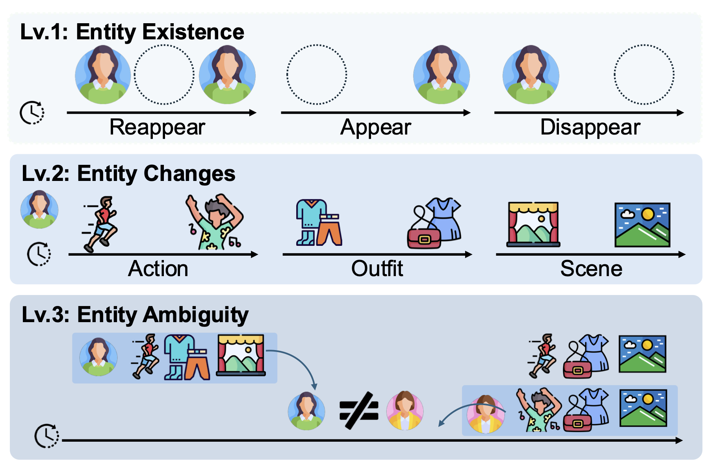
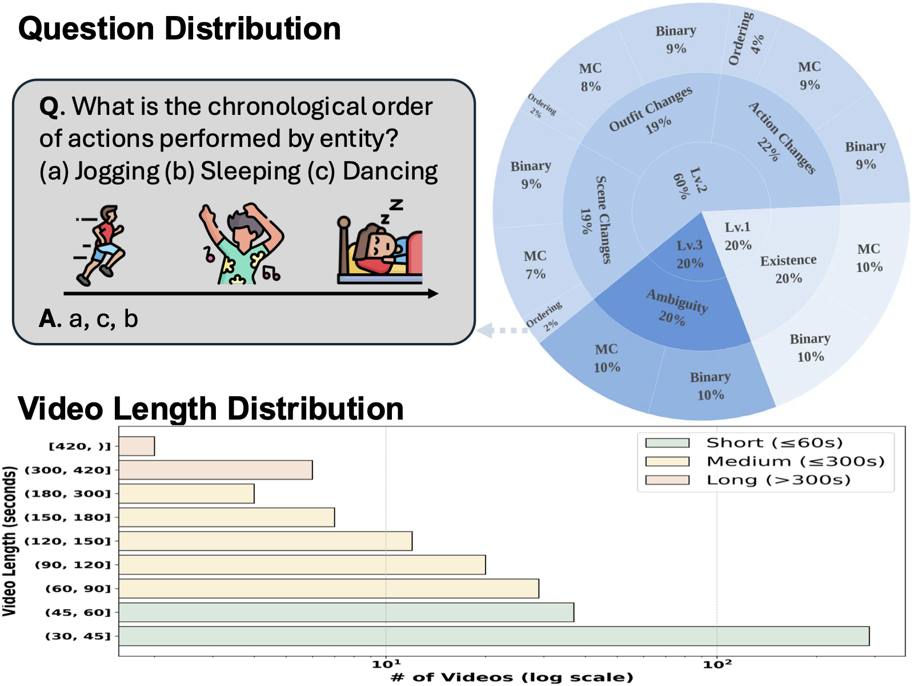
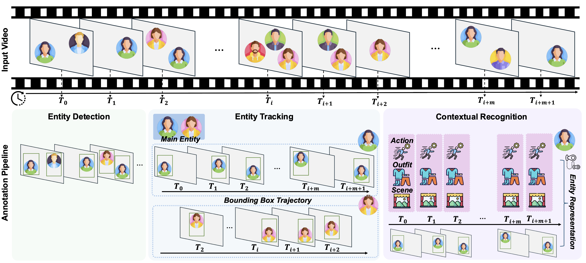

# NarrativeTrack: Evaluating Entity-Centric Reasoning for Narrative Understanding

This software project accompanies the research paper, [NarrativeTrack: Evaluating Entity-Centric Reasoning for Narrative Understanding](https://arxiv.org/abs/2601.01095v2).

## NarrativeTrack Overview
In the pursuit of building VideoLLMs that understand not only what happens but who does what, when, and where, NarrativeTrack introduces the first benchmark explicitly designed to evaluate **narrative understanding in videos through fine-grained entity tracking**.
NarrativeTrack moves beyond surface-level scene recognition by assessing a model’s ability to maintain **coherent, temporally grounded representations** of entities across time, capturing their appearances, actions, roles, and interactions as stories unfold.

True narrative understanding requires following entities consistently under occlusion, reappearance, and contextual change, which are capabilities largely overlooked by existing video benchmarks that focus on short clips or global semantics. NarrativeTrack addresses this gap through a *bottom-up, entity-centric evaluation* framework that decomposes videos into their constituent entities and examines their continuity and transformations across three hierarchical levels:
- 🧍 **Entity Existence**: tracking appearance, disappearance, and reappearance.
- 🔄 **Entity Changes**: reasoning over transitions in actions, scenes, and outfits.
- 🎭 **Entity Ambiguity**: testing temporal consistency and perceptual robustness under occlusion or visual similarity.

NarrativeTrack comprises 1,006 human-verified QA pairs over 324 video clips (average length 55.4 s), generated automatically from structured entity representations using a scalable, fully automated annotation pipeline.

🌟 Key Features:
- 🎬 **Entity-centric design**: Dense, temporally aligned annotations of bounding boxes, actions, scenes, and outfits.
- 🧩 **Graded taxonomy**: Three hierarchical levels capturing progressively harder narrative reasoning challenges.
- 🧠 **Comprehensive evaluation**: Binary, multiple-choice, and novel ordering QA formats probing temporal and perceptual reasoning.
- ⚙️ **Scalable automation**: A fully automated annotation pipeline integrating entity detection, tracking, and contextual recognition without any human supervision.

NarrativeTrack provides a diagnostic and scalable framework to measure how well MLLMs follow entities, reason about their evolving states, and maintain narrative coherence—laying the groundwork for the next generation of entity-centric, temporally grounded VideoLLMs.

<p align="center">
  
  
</p>

## Getting Started
### Installation
- Environment Setup 
```sh
apt-get update
apt-get install -y libsm6 libxext6 libxrender-dev
apt-get install -y libglib2.0-0 libgl1

apt install cmake
python -m pip install torch torchvision --index-url https://download.pytorch.org/whl/cu121 (Adjust to your CUDA version)
python -m pip install --no-cache-dir --no-build-isolation git+https://github.com/facebookresearch/detectron2.git
python -m pip install -r requirements.txt
pip install flash-attn --no-build-isolation
```
- Video Dataset Download
   - You should download video datasets by following [AVA-Actions](https://research.google.com/ava/download.html#ava_actions_download), [LVBench](https://huggingface.co/datasets/zai-org/LVBench), and [Video-MME](https://github.com/MME-Benchmarks/Video-MME?tab=readme-ov-file).

### Automated Data Annotation Pipeline
<p align="center">
  
</p>

- Overall Pipeline
  > For stage 4 and stage 6, you need either Gemini API or GPT-4 API access. Initialize it in `pipeline/gemini.py` file.
   - (stage 1, 2) `Preprocess`: Video Filtering (stage 1) & Main Character Selection (stage 2)
   - (stage 3) `Entity Detection & Tracking`
   - (stage 4) `Gemini Annotation & Filtering`
   - (stage 5) `Video Chunk Extraction`
   - (stage 6) `Action, Scene, Visual Appearance Recognition`

```sh
python data_pipeline.py --save_dir PATH/TO/DIR --video_type AVA/VideoMME/LVBench --num_gpus N --procs_per_gpu M --brightness_threshold threshold --use_owl --owl_model_type base --owl_thres 0.3 --stage 1 2 (stage that you want to run) --ava_csv_path (if video path is AVA)
```

#### QA Generation
- You need Gemini API or GPT-4 API access.
- Template: `templates.py`
- Before QA Generation: consistency of entity status check (See appendix for prompt details)
- After QA generation: option similarity check for multiple-choice, grammar check (See appendix for prompt details)
- Human verification on subset demonstrates that automatically-generated QA pairs from our pipeline are correct with 70% accuracy. 
  - To have more accurate QA pairs, you need to manually verify QA pairs.

### Evaluation
#### Prompt
```
You are an expert in video-based narrative understanding and entity tracking.

You will be given a video and a question. Your job is to generate an answer to the question based on what you observe in the video.

If the question is multiple choice, you should provide the answer as a single letter (a, b, c, etc.). If the question is binary, you should answer with "yes" or "no". If the question is ordering task, you should answer with a comma-separated string of the correct order (e.g., "b, a, c").  
Generate answer in JSON format with the following fields:

### Output Format:
```json
{{
  "answer": "Your answer here",
  "justification": "A brief explanation of how you arrived at the answer based on the video content"
}}

### Question: {question}
```
Please ensure that you download the video clips into `datasets` folder and extract `narrativetrack_qa.json` file from `download.py` file.

#### Model Download
- Download VideoChat2 in to `pretrained/videochat2` folder.
- Clone [VILA](https://github.com/NVlabs/VILA) and [VideoLLAVA](https://github.com/PKU-YuanGroup/Video-LLaVA), following the original instruction to setup the environment and run evaluation.
```sh
mkdir pretrained
cd pretrained
```

```py
python eval_pipeline.py --task eval --model_name MODEL_NAME --num_frames NUM_FRAMES --save_dir SAVE_DIR --qa_path datasets/narrativetrack_qa.json
```

## FAQ
You can generate your own QA pairs from our pipeline. But if you have any questions or requests, please contact **the first author** of our research paper.
